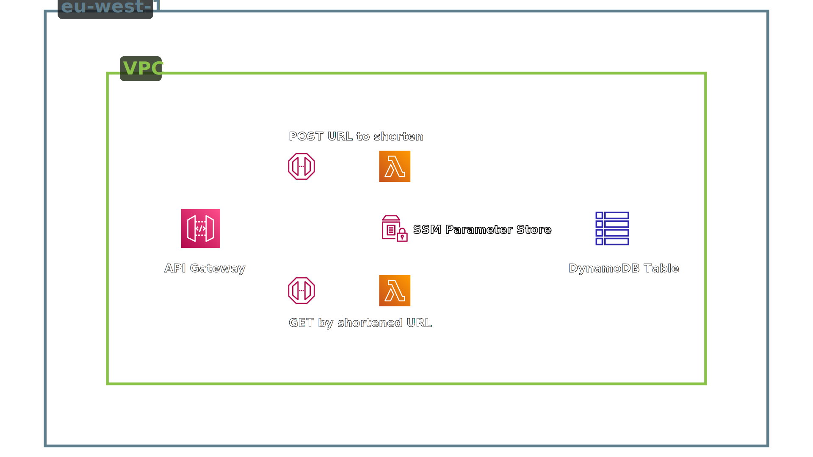

# Serverless URL shortener

This is a simple URL shortener implemented using API Gateway, AWS Lambda, and DynamoDB.

## Diagram




## Usage

### Deploy the stack

```bash
cdk deploy
```

### Create a short URL (POST):
```bash
curl -X POST https://<api-id>.execute-api.<region>.amazonaws.com/prod/shorten \
  -H 'Content-Type: application/json' \
  -d '{
    "url": "https://www.example.com"
  }'
```

### GET to the original URL
```bash
curl -I https://<api-id>.execute-api.<region>.amazonaws.com/prod/<short_url_code>
```
